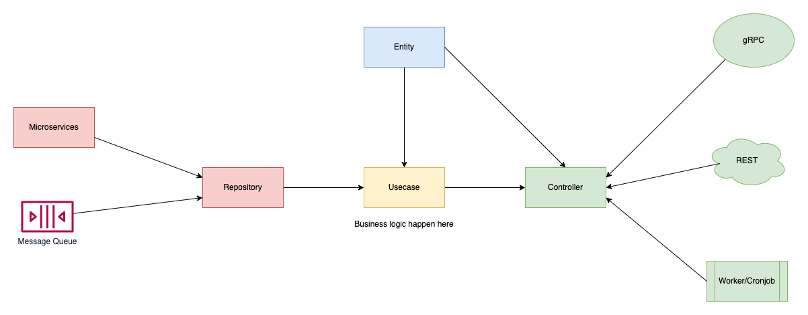

# Chợ Tốt backend standard structure for ct-logic

Following the [Clean Architecture](https://docs.google.com/presentation/d/1J7hoZvZJvk4G_8cNejZ4YCaZj6bvOsdOTNvWCOB9Ahc/edit?usp=sharing) and [Chotot System Architecture](https://docs.google.com/drawings/d/1ZVGcZfD_-GDWbQ-1zT5zyiysMnY9bXaikCmJK7Cyrbg/edit)

This source support: consumer (Kafka, RabbitMQ), cronjob, Rest API, gRPC

# Install and run on your computer

Run service: `go run main.go service`

Run worker with Kafka: `go run main.go worker_kafka`

Run worker with RabbitMQ: `go run main.go worker_rabbitmq`

# Diagram

# Directories

### `/cmd`

Define commands to run application.

Command is the central point of the application. Each interaction that the application supports will be contained in a Command. A command can have children commands and optionally run an action.

In the example, 'server', 'worker' is the command.

### `/config`

Configuration file templates or default configs.

### `/pkg`

This folder contains common packages to use by all packages on application.

## Logic Application Directories

### `/internal` contains 4 packages:

### `/controller`

The Controller layer is the conductor of operations for a request. The controller first dispatches to a command and then calls the appropriate view processing logic to render the response.

### `/entity`

Business logic models that are common to the system and can be used in any layer.

### `/repository`

Repositories are classes or components that encapsulate the logic required to access data sources or other services. 

### `/usecase`

The use case layer contains application specific business rules.
